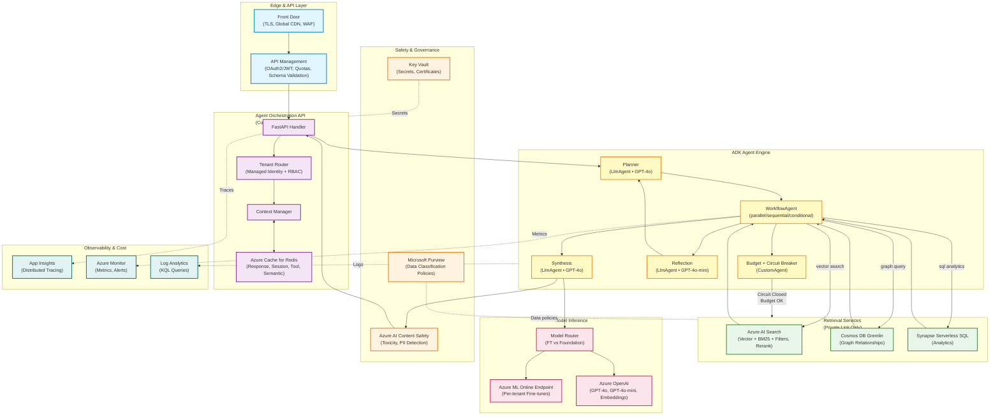
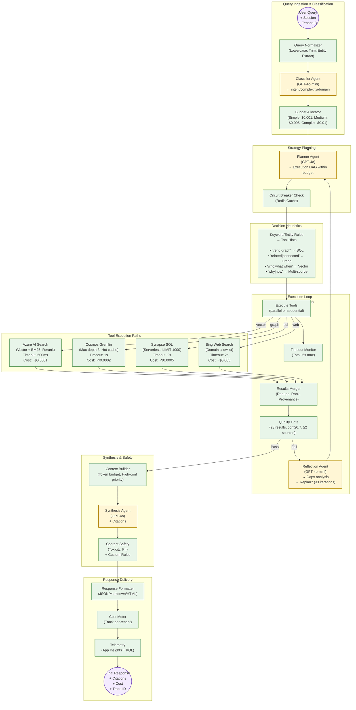
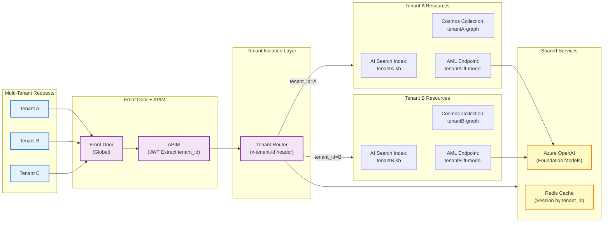
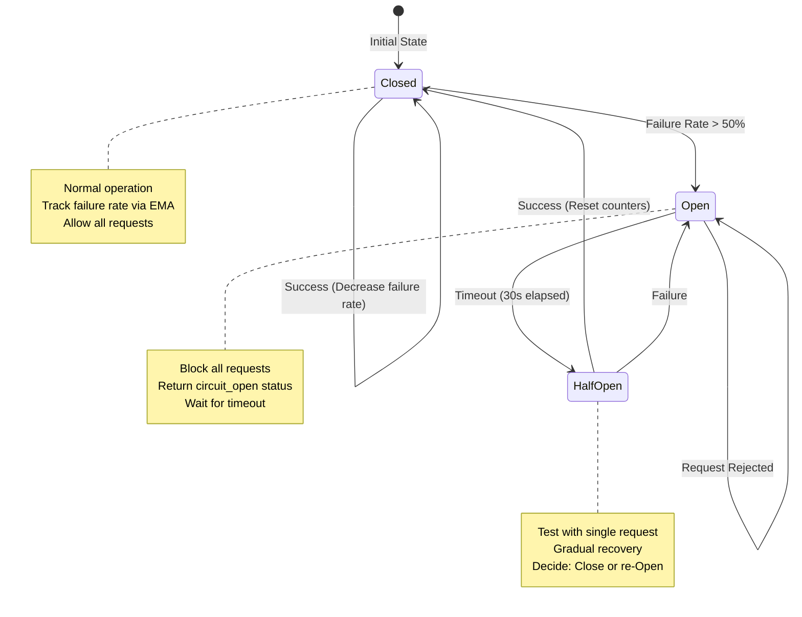
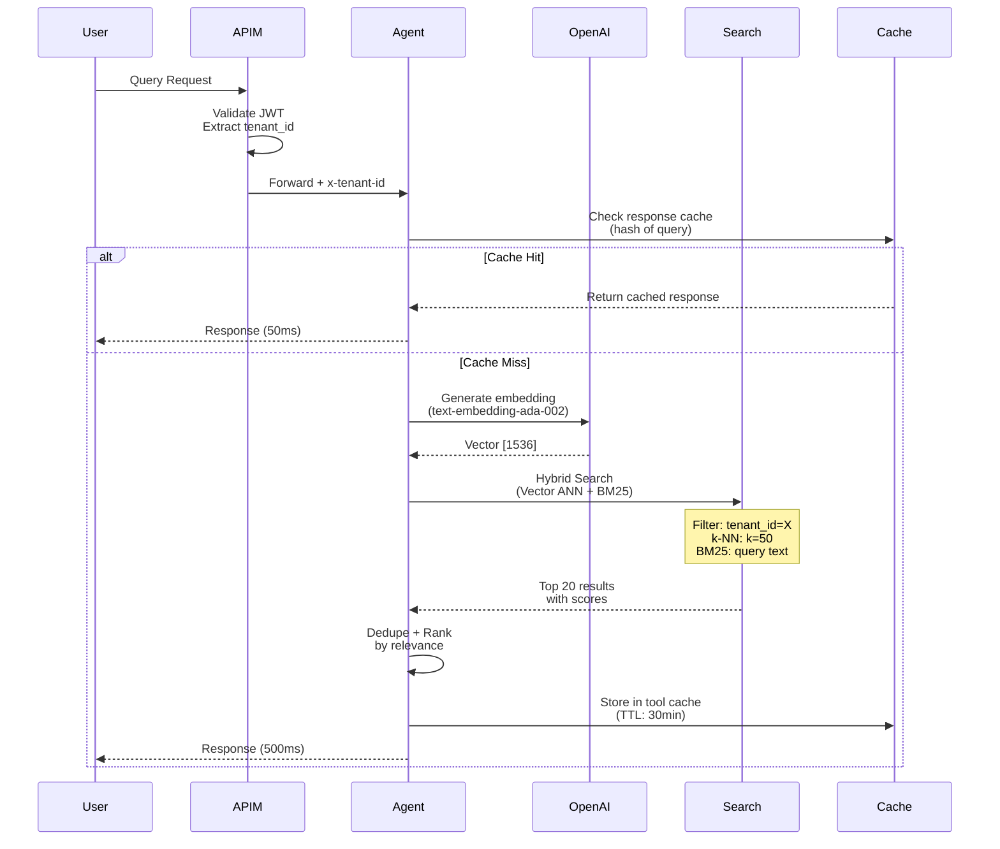
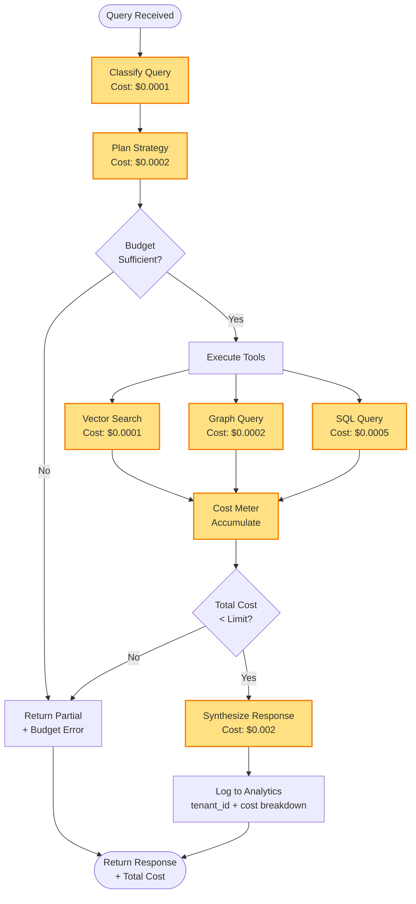
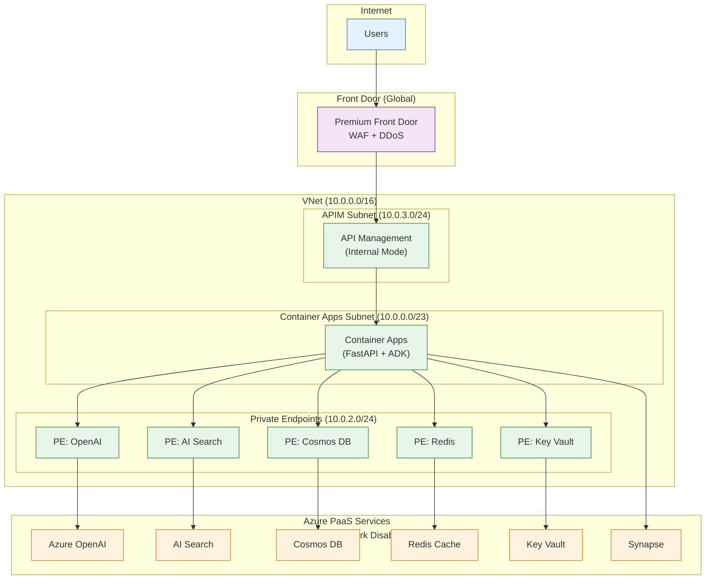

# Azure RAG Agent Architecture Diagrams

This document contains comprehensive architecture diagrams for the Azure RAG Agent system, including system architecture, query processing flows, multi-tenant design, and operational patterns.

## System Architecture

The overall system architecture showing all components and their relationships:

## Query Processing Flow

Detailed flow of how queries are processed through the system:

## Multi-Tenant Architecture

How the system handles multiple tenants with proper isolation:

## Circuit Breaker State Machine

The circuit breaker pattern implementation for fault tolerance:

## Data Flow - Hybrid Search

Sequence diagram showing the hybrid search process:

## Cost Tracking Flow

How costs are tracked and budgeted throughout the system:

## Network Architecture

The network topology and security boundaries:

## Key Design Principles

### 1. **Multi-Tenant Isolation**
- Each tenant has dedicated data stores (AI Search indexes, Cosmos collections)
- Tenant routing via JWT claims and header-based identification
- Shared compute with isolated data access

### 2. **Cost Management**
- Per-query budget allocation based on complexity
- Real-time cost tracking and circuit breaking
- Tool-level cost attribution and monitoring

### 3. **Fault Tolerance**
- Circuit breaker pattern for external service failures
- Timeout enforcement at multiple levels
- Graceful degradation with partial results

### 4. **Performance Optimization**
- Multi-level caching (response, session, tool, semantic)
- Parallel tool execution where possible
- Hybrid search with semantic ranking

### 5. **Security & Compliance**
- Private endpoints for all Azure services
- Content safety and PII detection
- Data classification policies via Purview
- Comprehensive audit logging

## Component Responsibilities

| Component | Responsibility | Key Features |
|-----------|---------------|-------------|
| **Front Door** | Global load balancing, WAF, DDoS protection | TLS termination, geographic routing |
| **API Management** | Authentication, rate limiting, schema validation | JWT validation, tenant extraction |
| **Container Apps** | Agent orchestration runtime | Auto-scaling, VNet integration |
| **ADK Engine** | Multi-agent workflow execution | Planner, WorkflowAgent, Reflection |
| **AI Search** | Hybrid vector + keyword search | Semantic ranking, tenant filtering |
| **Cosmos DB** | Graph relationship queries | Gremlin API, relationship traversal |
| **Synapse** | Analytics and reporting queries | Serverless SQL, large dataset processing |
| **Redis Cache** | Multi-level caching | Session, response, tool result caching |
| **Content Safety** | AI safety and compliance | Toxicity detection, PII filtering |

## Monitoring & Observability

The system provides comprehensive monitoring through:

- **Application Insights**: Distributed tracing, custom events, performance counters
- **Azure Monitor**: Infrastructure metrics, alerting, dashboards
- **Log Analytics**: KQL queries for operational insights
- **Cost Tracking**: Per-tenant cost attribution and budget monitoring

See the [monitoring workbook](../monitor/workbook.json) for detailed dashboard configurations.
